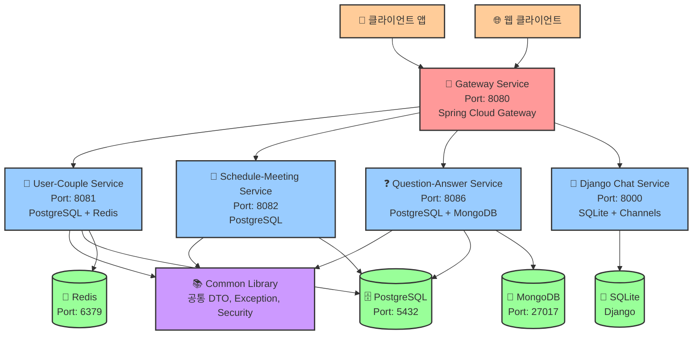

# Couple MSA 아키텍처 구조

## 전체 시스템 아키텍처



## 서비스별 상세 구조

### 1. Gateway Service (Port: 8080)
```
┌─────────────────────────────────────────────────────────────┐
│                    Gateway Service                          │
├─────────────────────────────────────────────────────────────┤
│ • Spring Cloud Gateway                                      │
│ • JWT 인증 필터                                             │
│ • 라우팅 설정                                               │
│ • WebSocket 프록시                                          │
├─────────────────────────────────────────────────────────────┤
│ 라우팅 규칙:                                                │
│ • /api/users/** → User-Couple Service (8081)               │
│ • /api/couples/** → User-Couple Service (8081)             │
│ • /api/schedules/** → Schedule Service (8082)              │
│ • /api/meetings/** → Schedule Service (8082)               │
│ • /api/questions/** → Question Service (8086)              │
│ • /api/user-answers/** → Question Service (8086)           │
│ • /api/user-vectors/** → Question Service (8086)           │
│ • /ws/** → Django Service (8000)                           │
└─────────────────────────────────────────────────────────────┘
```

### 2. User-Couple Service (Port: 8081)
```
┌─────────────────────────────────────────────────────────────┐
│                  User-Couple Service                        │
├─────────────────────────────────────────────────────────────┤
│ • Spring Boot + Spring Security                            │
│ • JWT 토큰 생성/검증                                        │
│ • 사용자 관리 (회원가입, 로그인)                            │
│ • 커플 매칭 및 관리                                         │
├─────────────────────────────────────────────────────────────┤
│ API 엔드포인트:                                             │
│ • POST /api/users/signup                                   │
│ • POST /api/users/login                                    │
│ • GET /api/users/profile                                   │
│ • POST /api/couples/match                                  │
│ • GET /api/couples/members                                 │
├─────────────────────────────────────────────────────────────┤
│ 데이터베이스:                                               │
│ • PostgreSQL: 사용자, 커플 정보                            │
│ • Redis: 세션, 캐시                                        │
└─────────────────────────────────────────────────────────────┘
```

### 3. Schedule-Meeting Service (Port: 8082)
```
┌─────────────────────────────────────────────────────────────┐
│                Schedule-Meeting Service                     │
├─────────────────────────────────────────────────────────────┤
│ • Spring Boot + Spring Security                            │
│ • 일정 관리 및 미팅 기능                                    │
│ • 날씨 정보 연동                                            │
├─────────────────────────────────────────────────────────────┤
│ API 엔드포인트:                                             │
│ • POST /api/schedules                                      │
│ • GET /api/schedules                                       │
│ • PUT /api/schedules/{id}                                  │
│ • DELETE /api/schedules/{id}                               │
│ • POST /api/meetings                                       │
├─────────────────────────────────────────────────────────────┤
│ 데이터베이스:                                               │
│ • PostgreSQL: 일정, 미팅 정보                              │
└─────────────────────────────────────────────────────────────┘
```

### 4. Question-Answer Service (Port: 8086)
```
┌─────────────────────────────────────────────────────────────┐
│                Question-Answer Service                      │
├─────────────────────────────────────────────────────────────┤
│ • Spring Boot + Spring Security                            │
│ • 질문 관리 및 답변 처리                                    │
│ • 태그 기반 프로필 시스템                                   │
│ • 벡터 기반 사용자 특성 관리                                │
├─────────────────────────────────────────────────────────────┤
│ API 엔드포인트:                                             │
│ • POST /api/questions                                      │
│ • GET /api/questions                                       │
│ • POST /api/user-answers                                   │
│ • GET /api/user-answers/my-answers                         │
│ • POST /api/user-vectors                                   │
│ • PUT /api/user-vectors/my-vector                          │
│ • GET /api/tags                                            │
├─────────────────────────────────────────────────────────────┤
│ 데이터베이스:                                               │
│ • PostgreSQL: 질문, 답변, 태그 정보                        │
│ • MongoDB: 사용자 벡터 데이터                              │
└─────────────────────────────────────────────────────────────┘
```

### 5. Django Chat Service (Port: 8000)
```
┌─────────────────────────────────────────────────────────────┐
│                  Django Chat Service                        │
├─────────────────────────────────────────────────────────────┤
│ • Django + Django Channels                                 │
│ • WebSocket 기반 실시간 채팅                                │
│ • JWT 인증 연동                                             │
│ • 채팅방 관리                                               │
├─────────────────────────────────────────────────────────────┤
│ API 엔드포인트:                                             │
│ • WebSocket /ws/chat/{room_id}/                            │
│ • POST /api/chat/rooms/                                    │
│ • GET /api/chat/rooms/                                     │
│ • POST /api/chat/messages/                                 │
├─────────────────────────────────────────────────────────────┤
│ 데이터베이스:                                               │
│ • SQLite: 채팅방, 메시지 정보                              │
└─────────────────────────────────────────────────────────────┘
```

## 데이터베이스 스키마

### PostgreSQL 데이터베이스들
```
┌─────────────────┐    ┌─────────────────┐    ┌─────────────────┐
│   postgres      │    │couple_schedule_db│    │question_answer_db│
│ (User-Couple)   │    │ (Schedule)      │    │ (Question)      │
├─────────────────┤    ├─────────────────┤    ├─────────────────┤
│ • users         │    │ • schedules     │    │ • questions     │
│ • couples       │    │ • meetings      │    │ • user_answers  │
│ • user_tokens   │    │ • places        │    │ • tags          │
│                 │    │ • keywords      │    │ • question_tags │
│                 │    │                 │    │ • user_tag_profiles│
└─────────────────┘    └─────────────────┘    └─────────────────┘
```

### MongoDB 컬렉션
```
┌─────────────────┐
│ question_answer_db│
├─────────────────┤
│ • user_vectors  │
│   - userId      │
│   - vectors     │
│   - updatedAt   │
└─────────────────┘
```

### Redis 저장소
```
┌─────────────────┐
│      Redis      │
├─────────────────┤
│ • 세션 데이터   │
│ • 캐시 데이터   │
│ • 임시 토큰     │
└─────────────────┘
```

## 인증 및 보안

```
┌─────────────────────────────────────────────────────────────┐
│                        인증 플로우                          │
├─────────────────────────────────────────────────────────────┤
│ 1. 클라이언트 → Gateway (로그인 요청)                       │
│ 2. Gateway → User-Couple Service                           │
│ 3. User-Couple Service → JWT 토큰 생성                      │
│ 4. 클라이언트 ← JWT 토큰                                    │
│ 5. 클라이언트 → Gateway (API 요청 + JWT)                   │
│ 6. Gateway → JWT 검증 + 헤더 추가                          │
│ 7. Gateway → 대상 서비스 (X-User-ID, X-Couple-ID)          │
└─────────────────────────────────────────────────────────────┘
```

## 기술 스택

### Backend
- **Spring Boot 3.2.0**: 모든 Java 서비스
- **Spring Cloud Gateway**: API Gateway
- **Spring Security**: 인증 및 권한 관리
- **Spring Data JPA**: PostgreSQL ORM
- **Spring Data MongoDB**: MongoDB 연동
- **Django 4.x**: 채팅 서비스
- **Django Channels**: WebSocket 지원

### Database
- **PostgreSQL**: 관계형 데이터 저장
- **MongoDB**: 벡터 데이터 저장
- **Redis**: 세션 및 캐시
- **SQLite**: Django 로컬 데이터

### Infrastructure
- **Gradle**: 빌드 도구
- **Flyway**: 데이터베이스 마이그레이션
- **Docker**: 컨테이너화 (선택사항)

## 배포 구조

```
┌─────────────────────────────────────────────────────────────┐
│                    개발 환경                                │
├─────────────────────────────────────────────────────────────┤
│ • 모든 서비스: localhost                                    │
│ • Gateway: 8080                                            │
│ • User-Couple: 8081                                        │
│ • Schedule-Meeting: 8082                                   │
│ • Question-Answer: 8086                                    │
│ • Django Chat: 8000                                        │
│ • PostgreSQL: 5432                                         │
│ • MongoDB: 27017                                           │
│ • Redis: 6379                                              │
└─────────────────────────────────────────────────────────────┘
```

## 확장성 고려사항

1. **수평 확장**: 각 서비스는 독립적으로 스케일링 가능
2. **데이터베이스 분리**: 서비스별 독립적인 데이터베이스
3. **캐싱 전략**: Redis를 통한 성능 최적화
4. **비동기 처리**: WebSocket을 통한 실시간 통신
5. **마이크로서비스 패턴**: 서비스 디스커버리, 로드 밸런싱 준비 